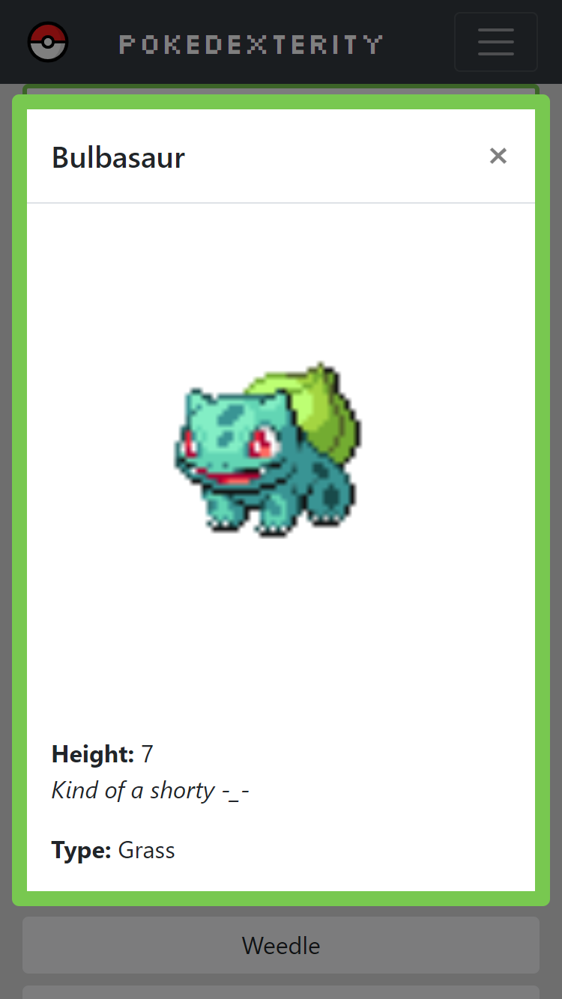
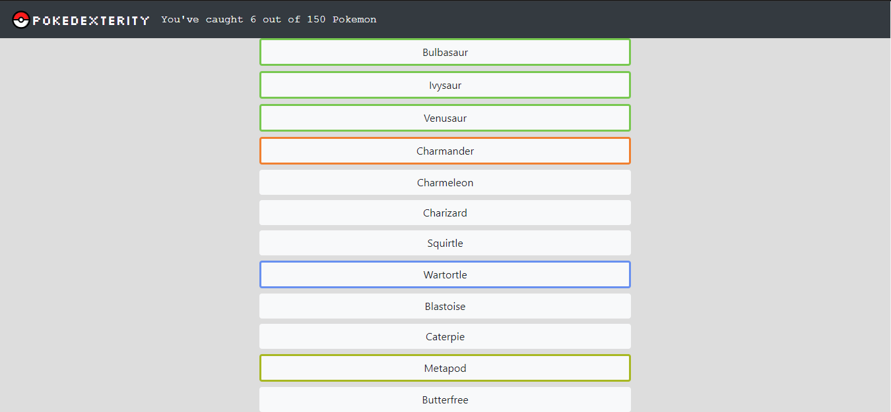

<a id="readme-top"></a>
<br />

<div align="center">
  <a href="https://guyrimel.github.io/Portfolio-Site/index.html">
    
  </a>

  <h3 align="center">PokeDexterity</h3>

  <p align="center">
    Pokedexterity is a 100% unique and user engaging Pokedex app — now with less sarcasm! The app fetches data from a well-maintained <a href="https://pokeapi.co/" target="_blank">Pokemon API</a> with vanilla ES6 JavaScript and displays each Pokemon in a simple "list of buttons" format.
  </p>
</div>
<br />

<!-- TABLE OF CONTENTS -->
<details>
  <summary>Table of Contents</summary>
  <ol>
    <li>
      <a href="#about-the-project">About The Project</a>
      <ul>
        <li><a href="#key-features">Key Features</a></li>
        <li><a href="#built-with">Built With</a></li>
      </ul>
    </li>
    <li>
      <a href="#getting-started">Getting Started</a>
      <ul>
        <li><a href="#prerequisites">Prerequisites</a></li>
        <li><a href="#installation">Installation</a></li>
        <li><a href="#ux-notes">UX Notes</a></li>
      </ul>
    </li>
    <li><a href="#license">License</a></li>
  </ol>
</details>

<!-- ABOUT THE PROJECT -->
## About The Project
<!-- SCREENSHOT -->


<!-- KEY FEATURES -->
### Key Features

1. Featuring sprites and data of 150 Pokemon.
2. Keep track of how many Pokemon you've caught so far!
3. Created with HTML, CSS, Javascript, and Node.js. Able to run right in the browser!
4. Fetch and promise pollyfills have been added for older browser and IE support.

<p align="right">(<a href="#readme-top">back to top</a>)</p>

<!-- BUILT WITH -->
### Built With

- HTML, CSS, JavaScript
- Node.js
- Bootstrap
- JQuery

<p align="right">(<a href="#readme-top">back to top</a>)</p>

<!-- GETTING STARTED -->
## Getting Started

<!-- PREREQUISITES -->
### Prerequisites
- git installed on your local machine

<p align="right">(<a href="#readme-top">back to top</a>)</p>

<!-- INSTALLATION -->
### Installation

1. Clone the repo
   ```sh
   git clone https://github.com/GuyRimel/Pokedexterity.git
   ```
2. Open the `index.html` file in your browser of choice.

- Note: The <a href="https://pokeapi.co/" target="_blank">Pokemon API</a> used for this app is free to use and requires no authentication or account creation.

<p align="right">(<a href="#readme-top">back to top</a>)</p>

<!-- UX NOTES -->
## UX-Notes

- The navbar displays a totalizer keeping track of how many pokemon you've "caught" (clicked) so far.
- Click on a Pokemon button from the list to see its sprite and information.
- Clicking a Pokemon button now applies a border with a type-based color e.g., a "fire" type Pokemon would get an orange border.

<p align="right">(<a href="#readme-top">back to top</a>)</p>

<!-- PROJECT DEPLOYMENT -->
## Project Links

Project Deployment: [https://guyrimel.github.io/Pokedexterity/](https://guyrimel.github.io/Pokedexterity/)

Project Repository: [https://github.com/GuyRimel/Pokedexterity](https://github.com/GuyRimel/Pokedexterity)

<p align="right">(<a href="#readme-top">back to top</a>)</p>

<!-- SCREENSHOTS -->
## Screenshots




<p align="right">(<a href="#readme-top">back to top</a>)</p>

<!-- LICENSE -->
## License

Distributed under the MIT License. See <a href="LICENSE.txt">`LICENSE.txt`</a> for more information.

<p align="right">(<a href="#readme-top">back to top</a>)</p>
